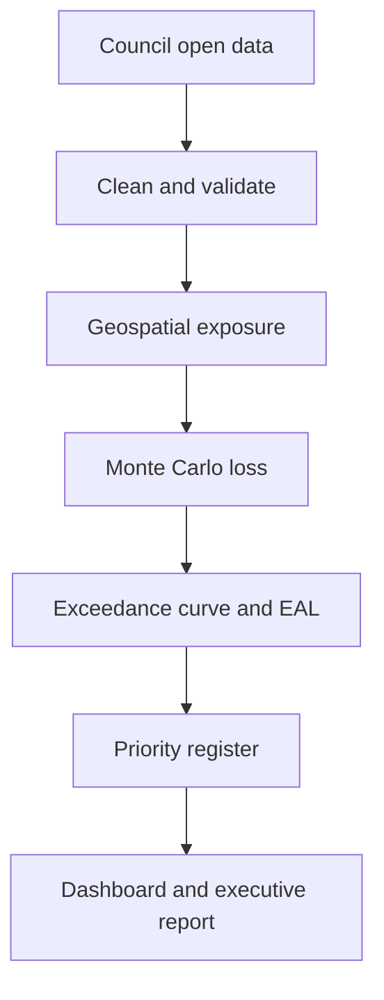

# Auckland Natural Hazard Asset Loss Engine

A reproducible data-science portfolio project that turns public natural-hazard maps into an asset-level financial-risk register for Auckland. It was designed for the **Data Scientist, Asset Financial Risk** vacancy and mirrors the role's core work: computational modelling, uncertainty analysis, automated scenario testing, geospatial data, probabilistic loss-exceedance curves, annualised loss estimates, data quality, databases, and decision communication.

The professional Streamlit dashboard includes an executive overview, interactive exposure map, downloadable priority register, scenario filters, uncertainty visualisation, methodology and data-quality controls. Windows users can follow the complete beginner-friendly instructions in [`LAPTOP_SETUP_GUIDE.md`](LAPTOP_SETUP_GUIDE.md).


## Decision question

Which public park and community-facility assets should be prioritised for more detailed investigation or resilience treatment under current coastal-inundation hazard and a **+1 metre sea-level-rise** scenario?

## What the pipeline does

1. Downloads public Auckland Council asset locations and eight coastal-inundation layers through ArcGIS REST.
2. Standardises 2,000+ asset records and produces an auditable data-quality report.
3. Spatially joins assets to 18.1%, 4.9%, 2%, and 1% annual exceedance probability extents.
4. Applies transparent, configurable replacement-value and vulnerability assumptions.
5. Runs 10,000 Monte Carlo iterations for replacement-value and damage uncertainty.
6. Produces event-loss distributions, loss-exceedance curves, expected annual loss (EAL), a criticality-adjusted priority score, and a mitigation scenario.
7. Loads the model into SQLite and publishes CSV, Parquet, charts, an executive report, an executed notebook, a standalone HTML dashboard, and a Streamlit app.



## Outputs

| Output | Purpose |
| --- | --- |
| `outputs/asset_risk_register.csv` | Asset-level EAL, criticality, priority score and risk band |
| `outputs/loss_exceedance_curve.csv` | Expected, P50 and P90 event loss at each AEP |
| `outputs/scenario_summary.csv` | Portfolio comparison across current, +1 m SLR and mitigation |
| `outputs/risk_model.db` | Queryable SQLite analytical database |
| `outputs/data_quality_report.json` | Missingness, duplicates, geometry validity and unmapped types |
| `outputs/reports/executive_summary.html` | Decision-facing summary for non-technical stakeholders |
| `notebooks/auckland_asset_risk_model.ipynb` | Fully executed technical walkthrough with tables, plots, SQL and QA |
| `dashboard/index.html` | Self-contained recruiter dashboard that opens without a server |
| `app.py` | Professional scenario, map, priority and data-quality dashboard |
| `LAPTOP_SETUP_GUIDE.md` | Complete Windows development and execution instructions |
| `docs/METHODOLOGY.md` | Equations, assumptions, validation and depth-versus-extent justification |

## Quick start

For the self-contained offline dashboard, double-click
`scripts\windows\open_offline_dashboard.bat` on Windows, or open
`dashboard/index.html` directly in any modern browser. It requires no Python,
Streamlit server or internet connection.

For the full modelling environment and interactive Streamlit dashboard:

```bash
python -m venv .venv
source .venv/bin/activate
pip install -e ".[dev]"
python -m asset_risk.pipeline --project-root . --refresh
python scripts/build_static_dashboard.py
streamlit run app.py
```

### Windows one-click setup

```bat
scripts\windows\setup.bat
scripts\windows\run_dashboard.bat
```

The offline dashboard preserves the scenario tabs, KPI cards, interactive
charts and priority tables. Use the Streamlit app when you need live filters,
search or CSV downloads.

To rerun the complete model from public source data:

```bat
scripts\windows\run_pipeline.bat --refresh
```

After the first run, omit `--refresh` to use the locally cached public data. Run `pytest -q` for unit tests. The package includes a fully executed notebook and an independent R EAL-validation script in `r/validate_loss_curve.R`.

## Verified portfolio-screening results

| Result | Current climate | +1 m SLR | +1 m SLR + treatment |
| --- | ---: | ---: | ---: |
| Assets assessed | 2,022 | 2,022 | 2,022 |
| Assets with modelled loss | 38 | 219 | 219 |
| Illustrative expected annual loss | NZ$0.79m | NZ$6.46m | NZ$4.20m |

The treatment scenario uses a stated 35% damage-reduction assumption. These are model outputs under the assumptions in `config/model.yml`, not observed Council losses or valuations.

## Model design

### Hazard and exposure

The model uses Auckland Council's coastal-inundation extents for four AEPs. Asset points intersecting a polygon are treated as exposed. Public hazard geometry is simplified to 20 metres during download to keep the portfolio workflow lightweight; this is suitable for an indicative screening model, not site-level engineering.

### Financial loss and uncertainty

For an exposed asset, expected conditional loss is:

\[
L_{i,e}=V_i \times DR_e \times M_s
\]

where \(V_i\) is illustrative replacement value, \(DR_e\) is the event damage ratio, and \(M_s\) is the scenario mitigation factor. Monte Carlo simulation samples a lognormal value factor, a beta-distributed damage ratio, and a systematic damage factor. P50 and P90 portfolio event losses are reported.

The model uses extent-based vulnerability because the public source layers do not provide an event-depth raster at every asset. A DEM alone cannot produce flood depth without an authoritative water-surface elevation. The full rationale and production upgrade path are documented in `docs/METHODOLOGY.md`.

Expected annual loss is the area under the loss-exceedance curve. The approximation holds the 1% AEP loss constant from AEP 0 to 0.01 and linearly reduces the 18.1% AEP loss to zero at AEP 1. These boundary assumptions are explicit in code and can be changed.

### Prioritisation

The decision score is EAL adjusted by service criticality:

\[
Priority_i = EAL_i \times (1 + 0.15(C_i-1))
\]

It is a transparent triage measure, not a benefit-cost ratio. A real investment case would add intervention cost, remaining useful life, service disruption, equity, interdependency, and avoided-loss benefits.

## Data sources and licence

- Auckland Council Open Data, **Park Asset Location**.
- Auckland Council Open Data, **Coastal Inundation** layers for 18.1%, 4.9%, 2%, and 1% AEP under present-day and +1 m sea-level-rise scenarios.
- Auckland Council open datasets are provided under **Creative Commons Attribution 4.0 International** and include accuracy, currency, and fitness-for-purpose disclaimers.

Source endpoints and modelling assumptions are centralised in `config/model.yml`. The downloader records the run time and uses retries, pagination and deterministic ordering.

## Important limitations

- Replacement values are illustrative modelling assumptions and **are not Auckland Council financial data**.
- Damage ratios are illustrative because the public layers used here show extent rather than water depth at each asset.
- Point exposure does not represent full building footprints or asset-network dependencies.
- Coastal inundation is only one natural hazard. Flooding, landslide and other hazards would be incorporated in a production multi-hazard model.
- Results are for portfolio screening and method demonstration only. They must not be used for engineering, valuation, insurance, regulatory or investment decisions.

## Skills demonstrated

Python, R, statistics, 10,000-iteration Monte Carlo simulation, geospatial analytics, data cleansing and standardisation, automated pipelines, scenario testing, uncertainty analysis, SQL/SQLite, data-quality management, Plotly, Streamlit, Jupyter, unit testing, CI, and stakeholder-ready communication.

## Repository structure

```text
├── app.py                         # Streamlit application
├── config/model.yml               # Sources and modelling assumptions
├── dashboard/index.html           # Standalone recruiter dashboard
├── docs/                          # Methodology and data dictionary
├── notebooks/                     # Executed technical walkthrough
├── outputs/                       # Verified tables, database, charts and report
├── r/                             # Independent R EAL validation
├── scripts/                       # Static-dashboard build step
├── src/asset_risk/                # Download, model, pipeline and reporting modules
├── sql/                           # Portfolio and data-quality queries
└── tests/                         # Unit tests
```
