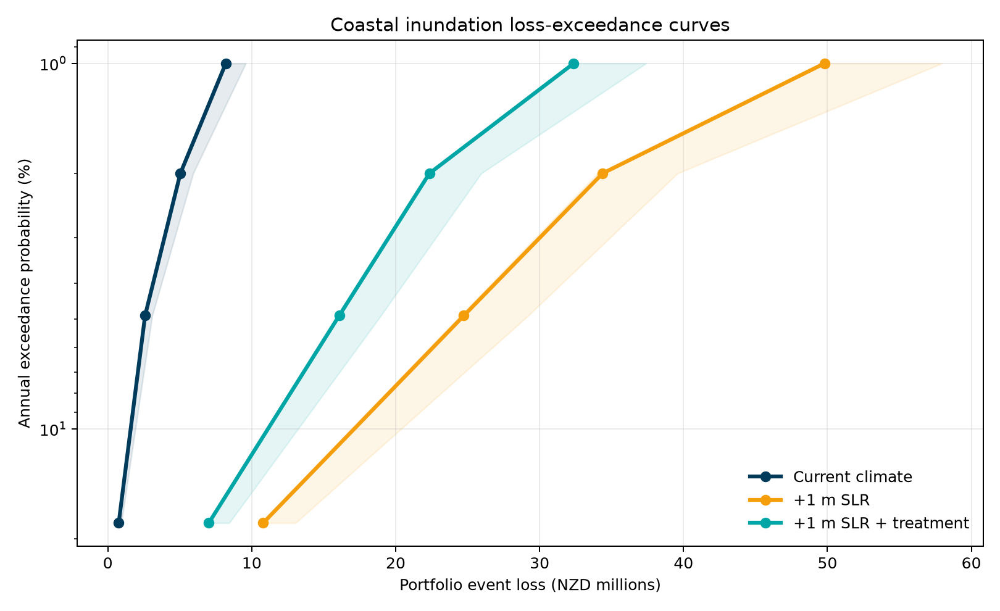
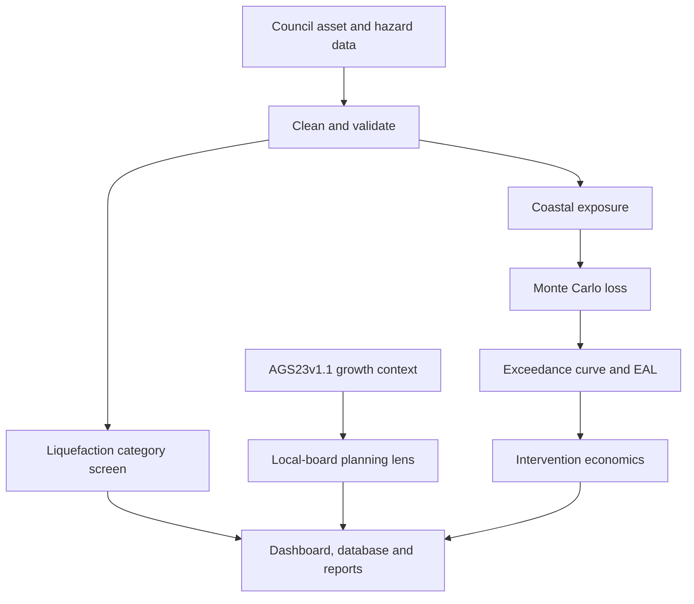

# Auckland Natural Hazard Risk Intelligence

A reproducible data-science portfolio project that turns public Auckland hazard and growth data into decision evidence for public assets. Coastal inundation is modelled financially through probabilistic loss and EAL; seismic liquefaction is kept as a separate vulnerability screen; Council growth projections provide service-demand context; and an explicit, cost-sensitive intervention appraisal demonstrates lifecycle economics. It was designed for the **Data Scientist, Asset Financial Risk** vacancy and mirrors the role's core work without presenting illustrative assumptions as Council facts.

The professional Streamlit dashboard includes an executive overview, multi-hazard screening, growth and demand context, interactive intervention economics, two map lenses, a downloadable priority register, uncertainty visualisation, methodology and data-quality controls. The quick start below covers browser-only, Windows one-click and command-line execution.



## Decision question

Which public park and community-facility assets should be prioritised for investigation or resilience planning when coastal financial risk, seismic vulnerability, future growth and treatment economics are considered transparently but not inappropriately blended?

## What the pipeline does

1. Downloads public Auckland Council asset locations, eight coastal-inundation layers and a regional liquefaction-vulnerability layer through ArcGIS REST.
2. Standardises 2,000+ asset records and produces an auditable data-quality report.
3. Spatially joins assets to 18.1%, 4.9%, 2%, and 1% annual exceedance probability extents.
4. Applies transparent, configurable replacement-value and vulnerability assumptions.
5. Runs 10,000 Monte Carlo iterations for replacement-value and damage uncertainty.
6. Produces event-loss distributions, loss-exceedance curves, expected annual loss (EAL), a criticality-adjusted priority score, and a mitigation scenario.
7. Assigns Council liquefaction categories as a non-financial screen and flags assets needing further geotechnical review.
8. Joins Auckland Growth Scenario 2023 v1.1 household, population and employment projections without changing EAL.
9. Calculates illustrative lifecycle cost, PV avoided loss, NPV, BCR, discounted payback and a 3×3 cost/discount sensitivity matrix.
10. Loads the evidence into SQLite and publishes CSV, Parquet, charts, an executive report, a standalone HTML dashboard and a Streamlit app.



## Outputs

| Output | Purpose |
| --- | --- |
| `outputs/asset_risk_register.csv` | Asset-level EAL, criticality, priority score and risk band |
| `outputs/loss_exceedance_curve.csv` | Expected, P50 and P90 event loss at each AEP |
| `outputs/scenario_summary.csv` | Portfolio comparison across current, +1 m SLR and mitigation |
| `outputs/asset_hazard_screening.csv` | Coastal exposure beside Council liquefaction category, coverage and review flags |
| `outputs/local_board_growth_context.csv` | AGS23v1.1 household, population and employment context beside scenario EAL |
| `outputs/intervention_economics.csv` | Asset lifecycle benefits, costs, NPV, BCR and payback under central assumptions |
| `outputs/intervention_portfolio_summary.csv` | Cost and real-discount-rate sensitivity matrix |
| `outputs/risk_model.db` | Queryable SQLite analytical database |
| `outputs/data_quality_report.json` | Missingness, duplicates, geometry validity and unmapped types |
| `outputs/reports/executive_summary.html` | Decision-facing summary for non-technical stakeholders |
| `notebooks/auckland_asset_risk_model.ipynb` | Fully executed technical walkthrough with tables, plots, SQL and QA |
| `dashboard/index.html` | Self-contained recruiter dashboard that opens without a server |
| `app.py` | Professional scenario, map, priority and data-quality dashboard |
| `docs/METHODOLOGY.md` | Equations, assumptions, validation and depth-versus-extent justification |

## Quick start

For the self-contained offline dashboard, double-click
`scripts\windows\open_offline_dashboard.bat` on Windows, or open
`dashboard/index.html` directly in any modern browser. It requires no Python,
Streamlit server or internet connection.

For the full modelling environment and interactive Streamlit dashboard:

```bash
python -m venv .venv
source .venv/bin/activate
pip install -e ".[dev]"
python -m asset_risk.pipeline --project-root . --refresh
python scripts/build_static_dashboard.py
streamlit run app.py
```

### Windows one-click setup

```bat
scripts\windows\setup.bat
scripts\windows\run_dashboard.bat
```

The offline dashboard preserves scenario tabs, KPI cards, interactive charts,
priority tables and dedicated liquefaction, growth and intervention sections.
Use the Streamlit app when you need live filters, search, assumption controls
or CSV downloads.

To rerun the complete model from public source data:

```bat
scripts\windows\run_pipeline.bat --refresh
```

After the first run, omit `--refresh` to use the locally cached public data. Run `pytest -q` for unit tests. The package includes a fully executed notebook and an independent R EAL-validation script in `r/validate_loss_curve.R`.

## Verified portfolio-screening results

| Result | Current climate | +1 m SLR | +1 m SLR + treatment |
| --- | ---: | ---: | ---: |
| Assets assessed | 2,022 | 2,022 | 2,022 |
| Assets with modelled loss | 38 | 219 | 219 |
| Illustrative expected annual loss | NZ$0.79m | NZ$6.46m | NZ$4.20m |

The treatment scenario uses a stated 35% damage-reduction assumption. These are model outputs under the assumptions in `config/model.yml`, not observed Council losses or valuations.

Additional verified screening and appraisal results:

| Evidence | Verified result |
| --- | ---: |
| Assets assigned a Council liquefaction category | 1,955 of 2,022 (96.7%) |
| Assets in `Damage Possible` category | 400 |
| `Damage Possible` assets also exposed under +1 m SLR | 109 |
| Intervention candidates with positive modelled avoided EAL | 219 |
| Central illustrative PV benefit / PV lifecycle cost | NZ$34.75m / NZ$21.03m |
| Central illustrative NPV / BCR / discounted payback | NZ$13.71m / 1.65 / year 12 |
| 2×-cost illustrative BCR at 5% | 0.83 |

The central intervention result is conditional on a static +1 m SLR stress case and demonstration cost assumptions. The 2×-cost result shows why it is not an investment recommendation.

## Model design

### Hazard and exposure

The model uses Auckland Council's coastal-inundation extents for four AEPs. Asset points intersecting a polygon are treated as exposed. Public hazard geometry is simplified to 20 metres during download to keep the portfolio workflow lightweight; this is suitable for an indicative screening model, not site-level engineering.

### Financial loss and uncertainty

For an exposed asset, expected conditional loss is:

\[
L_{i,e}=V_i \times DR_e \times M_s
\]

where \(V_i\) is illustrative replacement value, \(DR_e\) is the event damage ratio, and \(M_s\) is the scenario mitigation factor. Monte Carlo simulation samples a lognormal value factor, a beta-distributed damage ratio, and a systematic damage factor. P50 and P90 portfolio event losses are reported.

The model uses extent-based vulnerability because the public source layers do not provide an event-depth raster at every asset. A DEM alone cannot produce flood depth without an authoritative water-surface elevation. The full rationale and production upgrade path are documented in `docs/METHODOLOGY.md`.

Expected annual loss is the area under the loss-exceedance curve. The approximation holds the 1% AEP loss constant from AEP 0 to 0.01 and linearly reduces the 18.1% AEP loss to zero at AEP 1. These boundary assumptions are explicit in code and can be changed.

### Prioritisation

The decision score is EAL adjusted by service criticality:

\[
Priority_i = EAL_i \times (1 + 0.15(C_i-1))
\]

It is a transparent coastal-financial triage measure. It is not altered by the separate liquefaction or growth evidence.

### Multi-hazard screening

The second hazard is Auckland Council's Liquefaction Vulnerability – Basic Assessment. The pipeline produces one deterministic category per asset (`Damage Possible`, `Damage Unlikely`, `Very Low`, or `Not mapped`) and a review flag. It does **not** assign earthquake loss: the source is regional vulnerability mapping, not an earthquake event set, occurrence model or asset fragility model.

### Growth and service demand

The committed reference extract uses Auckland Council's current AGS23v1.1 projections for 2022–2052. Local-board household, population and employment changes sit beside asset count and EAL. Waiheke and Aotea/Great Barrier are aggregated to the source's combined geography. Growth is planning context, not a loss multiplier.

### Intervention economics

The sole monetised benefit is the asset-level difference between untreated and treated +1 m SLR EAL. Central demonstration assumptions are a 30-year horizon, 5% real discount rate, capital cost equal to the greater of 20% of illustrative value or NZ$50,000, and annual O&M equal to 1% of capital cost. The pipeline evaluates 0.5×, 1× and 2× costs at 3%, 5% and 7% real discount rates. All assumptions are replaceable in `config/model.yml`.

## Data sources and licence

- Auckland Council Open Data, **Park Asset Location** (endpoint recorded in `config/model.yml`).
- Auckland Council Open Data, **Coastal Inundation** layers for 18.1%, 4.9%, 2%, and 1% AEP under present-day and +1 m sea-level-rise scenarios (endpoints recorded in `config/model.yml`).
- Auckland Council Open Data, [**Liquefaction Vulnerability – Basic Assessment**](https://services1.arcgis.com/n4yPwebTjJCmXB6W/ArcGIS/rest/services/Liquefaction_Vulnerability_Basic_Assessment/FeatureServer/0).
- Auckland Council, [**Auckland Growth Scenario 2023 version 1.1**](https://www.knowledgeauckland.org.nz/publications/auckland-growth-scenario-2023-version-11-ags23v11-data/), local-board household, population and employment projections for 2022–2052.
- Auckland Council open datasets are provided under **Creative Commons Attribution 4.0 International** and include accuracy, currency, and fitness-for-purpose disclaimers.

Source endpoints and modelling assumptions are centralised in `config/model.yml`. The downloader records the run time and uses retries, pagination and deterministic ordering.

## Important limitations

- Replacement values are illustrative modelling assumptions and **are not Auckland Council financial data**.
- Damage ratios are illustrative because the public layers used here show extent rather than water depth at each asset.
- Point exposure does not represent full building footprints or asset-network dependencies.
- Coastal inundation is the only monetised hazard. Liquefaction is categorical screening only; rainfall flooding, landslide and other hazards remain future extensions.
- Liquefaction mapping is city-scale and is not suitable for property-level conclusions.
- Growth projections do not prove asset-level demand and are intentionally not used to inflate financial risk.
- Treatment effectiveness, capital cost and O&M are demonstration assumptions. The economics exclude service continuity, safety, equity, environmental outcomes, insurance, financing and programme interdependencies.
- Results are for portfolio screening and method demonstration only. They must not be used for engineering, valuation, insurance, regulatory or investment decisions.

## Skills demonstrated

Python, R, statistics, 10,000-iteration Monte Carlo simulation, multi-hazard geospatial screening, lifecycle economics, sensitivity analysis, demographic planning context, data cleansing and standardisation, automated pipelines, scenario testing, uncertainty analysis, SQL/SQLite, data-quality management, Plotly, Streamlit, Jupyter, unit testing, CI, and stakeholder-ready communication.

## Repository structure

```text
├── app.py                         # Streamlit application
├── dashboard_logic.py             # Testable UI calculations and filters
├── config/model.yml               # Sources and modelling assumptions
├── data/reference/                # Cited compact planning reference data
├── dashboard/index.html           # Standalone recruiter dashboard
├── docs/                          # Methodology and data dictionary
├── notebooks/                     # Executed technical walkthrough
├── outputs/                       # Verified tables, database, charts and report
├── r/                             # Independent R EAL validation
├── scripts/                       # Static-dashboard build step
├── src/asset_risk/                # Model, screening, growth, economics and reporting
├── sql/                           # Portfolio and data-quality queries
└── tests/                         # Unit tests
```
